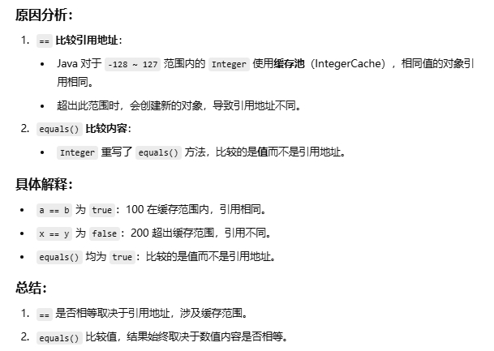

# 简单问题

## == 和 equals 方法的区别

+ 双等号在比较两个对象时用于比较**引用地址**是否相同 (比较基本数据类型时用于比较值是否相等)
+ equals 方法不能用于判断基本数据类型的变量, 只能用于判断两个对象是否相等. **<font style="color:blue">它在 Object 类中默认就是通过 `==` 号进行比较来实现的</font>**
  + 但大多数类(如 String / Integer )会对 `equals` 方法进行重写, **重写后用于比较两个对象中的属性是否相等**, 若它们的属性值都相同就会返回 true (即认为这两个对象相等)

## Integer包装类问题

`Integer a = 100; Integer b = 100;`,它们==和equals的结果是什么

`Integer x = 200; Integer y = 200;`的比较结果呢



# 什么时候要重写 hashcode()

+ **<font style="color:blue">重写了 `equals()` 时必须重写 `hashCode()`</font>**

+ 遵循 Java 的**通用约定**:
  + 如果两个对象根据 `equals()` 相等, 则它们的 `hashCode()` 也必须相等
  + 否则会导致使用基于哈希表的集合(如 HashMap / HashSet)时的行为异常

```java
class Person {
    String name;

    Person(String name) {
        this.name = name;
    }

    @Override
    public boolean equals(Object obj) {
        if (this == obj) return true;
        if (obj == null || getClass() != obj.getClass()) return false;
        Person person = (Person) obj;
        return name.equals(person.name);
    }
}

// 没有重写hashcode方法时
Person p1 = new Person("John");
Person p2 = new Person("John");

// 将对象存入HashSet
Set<Person> set = new HashSet<>();
set.add(p1);
System.out.println(set.contains(p2)); // false
```

+ 上述代码中 `p1.equals(p2)` 的结果为 true (也就是代表内容相等)
+ 但因为 Person 类中的 `hashCode()` 使用了默认实现, p1 和 p2 的哈希值不同, 导致 HashSet 无法识别 p2 已存在
  + 所以此时向 HashSet 集合中插入 p2 也能成功, 但 Set 集合本身是不允许有重复元素的, 这就属于一种行为异常

+ 因此应该重写 `hashcode` 方法

```java
@Override
public int hashCode() {
    return name.hashCode();
}
```

## 重写和重载的区别

首先从定义角度看, 重载是指方法名相同但参数列表不同; 而重写是指子类对父类方法进行重新实现


从发生时机上来看, **重载是编译时决定的, <font style="color:blue">也就是重载机制是由编译器在编译期间就选定好调用哪个方法</font>**, 不依赖对象的实际运行时的类型, 因此称为静态多态性; **<font style="color:blue">而重写是在运行时由JVM动态绑定决定调用哪一个方法实现</font>**, 所以属于动态多态性


从作用范围来看, **重载通常发生在一个类内部**, 也可以发生在子类继承父类方法的情况下, 只要方法名相同参数不同就能构成重载; **而重写一定是发生在子类和父类之间**


接着从方法签名的角度来看, **重载要求方法名相同, 参数列表必须不同, <font style="color:blue">而这种不同可以是参数个数不同、参数类型不同或者是参数顺序不同</font>**; **而重写要求方法名、参数列表必须完全一致**, 否则就不是重写


**另外重载对返回值没有要求, <font style="color:blue">也就是说不能仅靠返回值不同来构成重载</font>**; 重写中子类方法的返回值类型要与父类相同, 或者是原返回类型的子类型

从**访问修饰符**的角度来看, 重载的方法之间访问修饰符是可以不同的; 但在重写中, 子类方法的访问权限必须**不低于**父类中对应方法的访问权限


还有一点值得一提的是, **静态方法可以重载, 因为重载只依赖于参数列表**, 与是否是实例方法无关; **<font style="color:blue">而静态方法不能重写, 因为重写需要运行时看对象类型来决定方法行为</font>, 而静态方法是类级别的, 不走多态机制**

总的来说, 重载是**在一个类里定义多个方法来增强方法的灵活性**; 而重写是**子类改变父类行为来实现多态性**, 这两者既有表面上的相似性, 也有本质上的差异

# String

## 为什么String类不可变

- **<font style="color:blue">首先 String 类被 `final` 修饰</font>**: 表示这个类不能被继承, 防止有子类破坏其不可变性
- **其次 String 内部的字符数组( Java1.9 之后是 byte 数组)是被<font style="color:blue"> `private final` 修饰的</font>**
  - private 保证外部无法直接访问
  - final 保证引用不可更改, 不能指向另一个数组
  - 在 `String` 类内部也没有暴露修改的方法, 确保了数据不被改动

### 为什么要这么设计

**<font style="color:blue">安全性: 不可变的字符串在多个代码段之间共享时更安全</font>**. 如果字符串是可变的, 那么在共享时可能会导致不可预测的结果, 因为某个代码段可能会修改字符串的值, 影响其他代码段的逻辑


线程安全性: 由于 String 不可变, **<font style="color:blue">多个线程可以安全地共享同一个字符串对象, 而不需要额外的同步控制</font>**. 如果 String 可变, 那么多线程环境就需要加锁, 大大降低性能


hashcode 缓存优化: String 类对象会被频繁用作哈希键(比如在 HashMap / HashSet 集合中). 由于不可变, String 的哈希值是**惰性计算 + 缓存存储** 的(即第一次计算后就缓存, 不会变)

- 如果可变, 在修改字符串后其哈希值也会改变, 导致在哈希表中无法正确地找到先前插入的元素


支持字符串常量池: Java中有一个字符串池用于存储常量字符串, 以避免重复创建相同内容的字符串对象. **<font style="color:blue">不可变性确保相同内容的字符串只会在池中创建一次, 这有助于节省内存</font>**

- 如果 String 可变, 那么修改其中一个也会影响池中其它共享的引用, 破坏了缓存机制


最后不可变字符串使得代码更加清晰, 因为开发者可以信任一个字符串的内容不会在其他地方被修改. 这在调试和维护代码时非常有帮助

### 为什么底层要改成byte数组

JDK8 和之前的版本中 String 类内部使用的是 `char[]` , 无论字符串内容是否只包含英文每个字符都占用 2 个字节( `UTF-16` 编码)

- 从 JDK9 开始, **<font style="color:blue">为了节省内存</font>**, Java会先判断一个字符串是否可以用 ISO 8859-1 编码表示
  - 如果可以: 用 `byte[]` 存储 ISO 8859-1 编码的数据
  - 否则: 用 `byte[]` 存储 UTF-16 编码的数据, 并设置 `coder = 1`
  - **在 JDK 9+ 的 `String` 类中引入了一个`coder`属性, 它是一个 byte 类型的字段**, 用于标识这个字符串内部  `byte[]` 的编码方式 (**<font style="color:blue">0 -- `ISO 8859-1`, 1 -- `UTF-16`</font>**)

> **Latin-1** (Latin Alphabet No.1)是 **ISO / IEC 8859-1** 的非正式叫法, 每个字符占用 **1 个字节**
>
> 前128个字符与 ASCII 码一致, 后128个字符包含了一些 **西欧语言的特殊符号**

## String, StringBuilder, StringBuffer的区别

String 具有不可变性, 只要创建后就不能被修改, **如果被修改的话会创建一个新的字符串**. StringBuilder 和 StringBuffer 都是可变的字符串序列


String 由于不可变, 所以天生就是线程安全的. **而 StringBuffer 内部的方法加了 `synchronized` 锁, 所以多线程下也线程安全**. 而 StringBuilder 的方法没有进行同步处理, 所以多线程下不安全

- 但也因为没有同步开销, 所以 StringBuilder 的性能比 StringBuffer 要高. 另外对于不需要修改的字符串, String 的性能很好, **<font style="color:blue">但是如果需要进行大量的字符串拼接或修改操作, 使用 String 会非常低效</font>**


综上所述, String 适用于字符串内容基本不发生变化的场景, 比如作为常量 / 集合的 key 等. **StringBuffer 适用于多线程环境共享并修改同一个字符串序列时使用**. **<font style="color:blue">StringBuilder 就适合单线程的环境, 比如方法内局部对字符串进行大量的拼接或修改操作</font>**

# Java中是值传递还是引用传递

在 Java 中传递参数时, 无论是基本数据类型还是引用类型(如对象 / 数组), 使用的都是值传递的方式

- 对于基本类型, 传递的是**值的副本**

- **<font style="color:blue">对于引用类型, 传递的是引用地址的副本, 而非对象引用本身</font>**

  - **方法中你仍然可以通过这个引用的副本来修改对象的内容, 但如果你在方法中把这个地址换成指向另一个对象, 并不会影响原变量的指向**. 示例代码如下

  ```java
  // 验证: Java虽然传递的是引用地址的副本, 但通过这个地址副本仍然能修改原对象的内容
  public class PassExample {
      public static void main(String[] args) {
          // name 存储的是数组对象在堆内存中的地址
          char[] name = {'磊', '哥'};
          System.out.println("调用方法前：" + new String(name));
          // 传递的并不是name本身, 而是name指向的那个数组地址的副本
          method(name);
          System.out.println("调用方法后：" + new String(name));
      }
  
      private static void method(char[] n) {
          // 通过地址副本访问到堆上的原始数组对象并进行了修改, 所以main方法中的name也被修改了
          n[1] = '神';
          System.out.println("方法中修改为：" + new String(n));
      }
  } // 输出 -- 调用方法前：磊哥  方法中修改为：磊神  调用方法后：磊神
  
  // --------------- 反例补充: 修改的是引用本身而非内容的情况
  public class PassExample {
      public static void main(String[] args) {
          char[] name = {'磊', '哥'};
          System.out.println("调用方法前：" + new String(name));
          method(name);
          System.out.println("调用方法后：" + new String(name));
      }
      private static void method(char[] n) {
          // 这行代码使得 n 不再指向原来的数组, 而是一个新建的空数组
          n = new char[2]; // 只是修改了新数组的内容, 对原数组没有任何影响
          n[1] = '神';
          System.out.println("方法中修改为：" + new String(n));
      }
  }// 输出 -- 调用方法前：磊哥  方法中修改为： 神  调用方法后：磊哥
  ```

# 讲一下Java中的异常

Java中把异常当作对象来处理, 并定义了 Throwable 类作为所有异常的根类. 它有两个直接子类, 分别是Error 和 Exception


**<font style="color:blue">Error 异常由 Java 虚拟机生成并抛出, 一般代表出现了严重的系统级错误</font>**. 此类错误一般表示代码运行时 JVM出现问题, 并且出现这种错误一般程序是无法恢复的

常见的 Error 错误有: 

- `OutOfMemoryError` (也就是OOM): 表示堆内存耗尽, 通常是由于创建了大量对象并且**这些对象在内存中长期存活, 无法被垃圾回收器及时回收**所导致
- `StackOverflowError`: 一般是因为方法递归次数太多, 导致栈空间用光

此类错误发生时, JVM一般会选择终止线程, 并输出异常信息

---

**<font style="color:blue">Exception 表示程序在编译期或运行期间可能出现的异常情况</font>**, 开发者需要**显式处理**或**通过逻辑避免**

Exception 异常又分为两大类: 分别是编译时异常(也叫受检异常)和运行时异常. 并且运行时异常都会继承一个叫 `RuntimeException` 的父类


**编译时异常就是指在程序编译阶段开发者必须处理的异常. <font style="color:blue">如果不显示的进行 try-catch 或者 throws, 编译器会报错, 程序也就无法编译通过</font>**

**<font style="color:blue">这些异常通常源于外部环境的不确定性</font>, Java 设计者希望开发者必须显示地处理它们, 以增强程序的健壮性**. 常见的编译时异常有:

- 进行文件读写 / 网络通信过程中, 由于存在数据流中断等风险, 所以这种情况 Java 要求必须处理`IOException` (也就是输入输出异常)
- 在通过 `Class.forName("...")` 等方式加载类时, **由于类名拼写错误、类未编译或不在类路径中等问题可能导致加载失败**, 这种情况下 Java 要求必须处理 `ClassNotFoundException` (类加载异常)
- 在使用 JDBC 操作数据库时, SQL 语法错误或者连接异常问题都可能出现, Java 中就以`SQLException`表示这类数据库操作异常

> 补充: 当尝试读取某个文件时, 可能因为路径不存在、权限不够或者类型不合法等原因导致文件无法访问， 因此会抛出 `FileNotFoundException` (该异常其实就是 `IOException` 的子类)
>
> 在调用 `sleep()`、`join()`、`wait()` 等阻塞方法时, **如果当前线程被其他线程中断**, 则会抛出 `InterruptedException` (线程中断异常)


再说运行时异常, 运行时异常就是指**程序在运行过程中可能发生的异常**, Java 并不强制要求开发者显式捕获或抛出这些异常

**另外因为 Java 编译器不会检查它**, 也就是说就算当程序中可能出现这类异常时, **<font style="color:blue">即使没有用 try-catch 语句捕获它, 也没有用 throws 子句声明抛出它, 也会编译通过</font>**

这类异常大多数是**由程序逻辑错误引起的**, 如数组越界、空指针错误等. 常见的运行时异常包括:

- 在访问一个为 null 的对象引用时调用其方法或属性, 会抛出 `NullPointerException`, 也就是空指针异常
- **在访问数组时, 如果使用了负数或超出数组范围的下标**
  - 就会抛出 `ArrayIndexOutOfBoundsException` 数组越界异常

> 补充: 当使用不合法的格式将字符串转换为数字(如 `"abc"` 转为 `Integer`), 会抛出`NumberFormatException` -- 数字格式化异常
>
> 在执行**<font style="color:blue">整数除法时除数为 0</font>**, 会抛出 `ArithmeticException` -- 算术异常
>
> 当试图将一个对象强制转换为一个它**实际并不是的类型**时(比如某个不相干的子类), 会抛出 `ClassCastException` -- 类型转换异常

## Java中出现异常情况怎么处理

参考博客: https://cloud.tencent.com/developer/article/2088784?policyId=20240000&frompage=seopage

在Java中有一个异常处理的抓抛模型

过程一就是 "抛": **程序在正常执行过程中, 一旦出现异常, <font style="color:blue">就会在异常代码处生成一个对应异常类的对象</font>, 并将此对象抛出**

> 但异常对象其实不仅可以由系统自动生成, 还**<font style="color:blue">可以通过手动生成然后再用 throw 关键字将其抛出</font>**

过程二是 "抓": 可以理解为异常的处理方式. Java中提供了两种处理异常的方式


第一种方式是使用 `try-catch-finally` 结构. **<font style="color:blue">其中 try 不能单独使用, 必须搭配 catch 或者 finally之一</font>**, 也就是说**可以选择只用 try-catch 或者只用 try-finally, 当然也可以同时使用**

- **这种方式捕获异常的第一步是使用 try 语句块选定捕获异常的范围, 将可能出现异常的代码放在 try 语句块中**. 之后在执行过程中一旦出现异常, 就会根据此异常对象的类型去 catch 块中进行匹配. 一旦匹配到某一个 catch 时, 就会进入 catch 中进行异常处理
  - 在没有写 finally 的情况下, 一旦处理完成就跳出当前的 try-catch 结构, 继续执行后面的代码
  - **另外在 try 结构中声明的变量, 出了 try 结构后就不能再被调用**
- catch 语句块中是对异常对象进行处理的代码, **<font style="color:blue">每个 try 语句块可以伴随一个或者多个 catch</font>, 用于处理可能产生的不同类型的异常对象**
  - catch 中的异常类型如果没有父子关系, 则谁声明在上, 谁声明在下无所谓; **<font style="color:blue">如果异常类型满足父子关系, 就要求子类一定要声明在父类的上面, 否则会报错</font>**
- **finally 块为异常处理提供了一个统一的出口, 一般用于执行一些清理工作**, 比如关闭资源、状态管理之类的. 无论 try 块中是否发生了异常事件、catch 是否执行或者 catch 中是否又出现了异常、再或者 try-catch 中是否包含了 return 语句
  - finally 中的代码都会在控制流离开 try-catch 结构之前执行
  - **<font style="color:blue">另外不应该轻易在 finally 块中使用 return 语句, 因为它会覆盖掉 try 或 catch 块中的返回值, 还会吞掉原本抛出的异常</font>**; **如果 finally 块中抛出了异常, 也会覆盖 try 或 catch 中原本要返回的值或抛出的异常**, 最终只有 finally 中的异常会被抛出


**异常处理的第二种方式就是使用 throws 关键字声明抛出异常**. 这种方式就是将 **`throws <异常类型>` 语句写在方法的声明处**, 表明此方法执行时可能会抛出的异常类型

如果一个方法在执行时可能生成某种异常, 但是**<font style="color:blue">并不能确定如何处理异常</font>, 那么就应该用这种方式显示地声明抛出异常**. 表明该方法将不对这些异常进行处理, 而由该方法的调用者负责处理

- 另外在方法声明中用 throws 也可以声明抛出异常的列表, **throws 后面的异常类型可以是方法中产生的异常类型, 也可以是其父类**
- 并且在重写方法时要注意**子类**重写后的方法**抛出的异常类型不应该大于父类**的方法所抛出的异常类型
  - **<font style="color:blue">但这个规则只适用于编译时异常, 运行时异常没有此限制, 子类可以自由抛出</font>**


**在实际开发中如果父类中的方法没有通过 throws 的方式处理异常, 那么子类重写的方法也不能使用 throws**, 也就是说如果子类重写的方法中有异常, 应该使用 `try-catch-finally` 方式处理

另外如果有一组递进调用关系的代码 (比如方法a调用方法b, 方法b再调用方法c这种), 建议在下层的方法中使用 throws 将异常逐层向上传递, 然后在最上层的方法中用 `try-catch-finally` 统一处理异常


# API层面

## 字符串相关

Q: 字符串中a替换b用哪个函数

A: **可以使用 replace 方法, 这个方法<font style="color:blue">既可以替换旧字符为新字符也可以替换旧子串为新子串</font>**. **方法的第一个参数是想要被替换掉的字符或字符串; 第二个参数是用来替换的新字符 / 字符串**

**另外也可以使用 replaceAll 方法**, 该方法也接收两个参数, 第二个参数和 replace 一致都是用于替换的字符串, **<font style="color:blue">但第一个参数接收的是正则表达式</font>**. 举个例子: 

```java
String str = "a.b.c";
// 使用 replace (按字面值替换)
String res = str.replace(".", "-");
// 使用 replaceAll(按正则替换)
// 这里就会导致问题, 因为正则中"."表示任意单个字符. 所以这么写的话每个字符都会被替换
String res = str.replaceAll(".", "-"); 

// 如果想用 replaceAll 替换真正的点号, 必须写成
str.replaceAll("\\.", "-");
```

所以如果只是单纯替换字符为字符串, 不建议用 replaceAll 方法, 因为它支持正则, 性能略差且容易出错

---

Q: 字符串中想找到首个 a 用哪个函数

A: 使用 `indexOf` 方法, **<font style="color:blue">返回值就是传入的字符串第一次出现的位置(从 0 开始计数)</font>**, 如果未找到返回 -1

- **另外`indexOf`也支持从某个索引开始查找**

```java
// 从 fromIndex 位置开始查找字符串 str 第一次出现位置
int indexOf(String str, int fromIndex);
```

> `startsWith` 方法不能用于查找查找某个子串在字符串中第一次出现的位置
>
> **<font style="color:blue">`str.startsWith("a")`: 判断的是这个字符串是不是以 "a" 开头</font>**

## 日期相关

| 类名          | 说明                                                         |
| ------------- | ------------------------------------------------------------ |
| LocalDate     | 表示不含时间的日期, 例如 2025-06-01                          |
| LocalTime     | 表示不含日期的时间, 例如 10:15:30                            |
| LocalDateTime | 表示包含日期和时间, 例如 2025-06-01T10:15 <br /> T是作为 Time 的一个提示符, 该格式是 ISO8601 的标准 |
| Period        | 表示两个日期之间的"年 / 月 / 日差距"                         |
| Duration      | 表示两个时间之间的"时 / 分 / 秒差距"                         |

Q: 日期计算用哪个类

A: 日期计算最好使用 Java8 引入的 `ChronoUnit` 或者 `Period` / `Duration` 进行操作

- `ChronoUnit` **是一个枚举类, 内部定义了所有常见的时间单位**. **<font style="color:blue">用于计算两个时间点之间的精确差值 (支持以"天 / 小时 / 分钟"等任意单位返回)</font>** [返回类型为 long]

  - **支持 LocalDate, LocalDateTime, Instant 等多种时间类型** (但必须是实现了 Temporal 接口的类, 所以老版本的 Date 或 Calendar 都不支持)

  ```java
  // 老版本的类应该先转换为 Instant 或 LocalDate 再用 ChronoUnit
  LocalDate d1 = date1.toInstant().atZone(ZoneId.systemDefault()).toLocalDate();
  LocalDate d2 = date2.toInstant().atZone(ZoneId.systemDefault()).toLocalDate();
  
  long days = ChronoUnit.DAYS.between(d1, d2);
  ```

```java
long days = ChronoUnit.DAYS.between(date1, date2); // 相差天数
long hours = ChronoUnit.HOURS.between(time1, time2); // 相差小时
long seconds = ChronoUnit.SECONDS.between(t1, t2); // 相差秒数
```

> 当参数是 LocalDate: `ChronoUnit.DAYS.between(...)` **会按照"日历逻辑"计算**, 不考虑具体时间(只看日期差). **<font style="color:blue">当参数是 LocalDateTime 或 Instant类型时: 会精确计算是否"满24小时", 满了才算作 1 天</font>**

- **Period 用于计算两个日期之间的差异 (年月日字段)**, 只能用于 LocalDate
  - **不能用 `period.getDays()` 来表示"总共多少天"**. **<font style="color:blue">它只表示日字段的差值</font>**, 跟 `ChronoUnit.DAYS` 计算的总天数不一样

```java
// 返回值是"年+月+日", 不是总天数. 适合用于展示, 如：“你已经工作了 2年3个月5天”
Period period = Period.between(LocalDate.of(2020,1,1), LocalDate.of(2024,6,1));
System.out.println(period.getYears()); // 4
System.out.println(period.getMonths()); // 5
System.out.println(period.getDays()); // 0
```

- Duration 表示两个时间点之间的时长 (时分秒, **也可以用来计算相差几天**), 适用于 LocalDateTime 或者Instant. **计算结果可以精确到毫秒甚至纳秒**

```java
Duration duration = Duration.between(
    LocalDateTime.of(2024, 1, 1, 10, 0),
    LocalDateTime.of(2024, 1, 1, 12, 30)
);

System.out.println(duration.toHours()); // 2
System.out.println(duration.toMinutes()); // 150
System.out.println(duration.toMillis()); // 9000000

// 基于精确时间差计算相差几天, 不是日历意义上的跨了几天
System.out.println(duration.toDays()); // 输出 0(因为还没满24小时)
```

---

Q: 日期格式化用什么方法

A: Java8 开始推荐的方式如下, 其中分两种情况

```java
// 将 LocalDateTime -> 格式化为字符串
LocalDateTime now = LocalDateTime.now();
DateTimeFormatter formatter = DateTimeFormatter.ofPattern("yyyy-MM-dd HH:mm:ss");

String formatted = now.format(formatter);
System.out.println(formatted);  // 输出类似: 2025-06-01 16:30:45

// 将字符串 -> 解析成 LocalDateTime
String dateStr = "2025-06-01 16:30:45";
DateTimeFormatter formatter = DateTimeFormatter.ofPattern("yyyy-MM-dd HH:mm:ss");

LocalDateTime dateTime = LocalDateTime.parse(dateStr, formatter);
System.out.println(dateTime);  // 输出: 2025-06-01T16:30:45
```

> 老版本做法: 使用 java.text 包中的 `SimpleDateFormat`
>
> ```java
> SimpleDateFormat sdf = new SimpleDateFormat("yyyy-MM-dd HH:mm:ss");
> String formatted = sdf.format(new Date());
> ```
>
> **现在并不推荐该做法, 因为线程不安全且设计混乱**

日期格式化常用符号补充: 

- E -- 星期几 (比如 Sun), **可以连续使用多次控制长短 -- 如 EEEE 可以将 Sun 变换为 Sunday**

  - **具体以什么语言输出取决于默认语言环境**, 但也可以用如下方式指定:

  ```java
  // 指定中文环境
  DateTimeFormatter fmt2 = DateTimeFormatter.ofPattern("EEEE", Locale.CHINA);
  System.out.println(LocalDate.now().format(fmt2));
  ```

  - **如果没在代码中设置 Locale: Java 会用 JVM 启动时的默认值, <font style="color:blue">而这个默认值会受到操作系统语言或区域设置的影响</font>**

- a: 上 / 下午 (AM / PM); SSS: 毫秒

---

Q: LocalDateTime 中还有哪些方法?

```markdown
1. 时间加减 (举几个例子, 剩下的以此类推)
	- `plusDays(long days)` 加天数; `minusDays(long days)` 减天数
	- `plusWeeks(long weeks)` 加周数; `plusMonths(long months)` 加月数
	- `plusHours(long hours)` 加小时; `plusSeconds(long seconds)` 加秒数
	
2. 提取时间字段
	- `getYear()` 获取年份; `getDayOfMonth()` 获取几号
	- **`getMonth()` 获取月份(返回枚举); `getMonthValue()` 获取月份(返回int)**
	- `getDayOfWeek()` 获取星期几(返回枚举, 想获取值需要再调用`getValue()`方法)
	- `getHour()` 获取小时; `getMinute()` 获取分钟; `getSecond()` 获取秒数
```

案例: 加三天, 减一小时并格式化

```java
LocalDateTime now = LocalDateTime.now();
LocalDateTime result = now.plusDays(3).minusHours(1);

String formatted = result.format(DateTimeFormatter.ofPattern("yyyy-MM-dd HH:mm:ss"));
System.out.println("结果时间: " + formatted);
```


